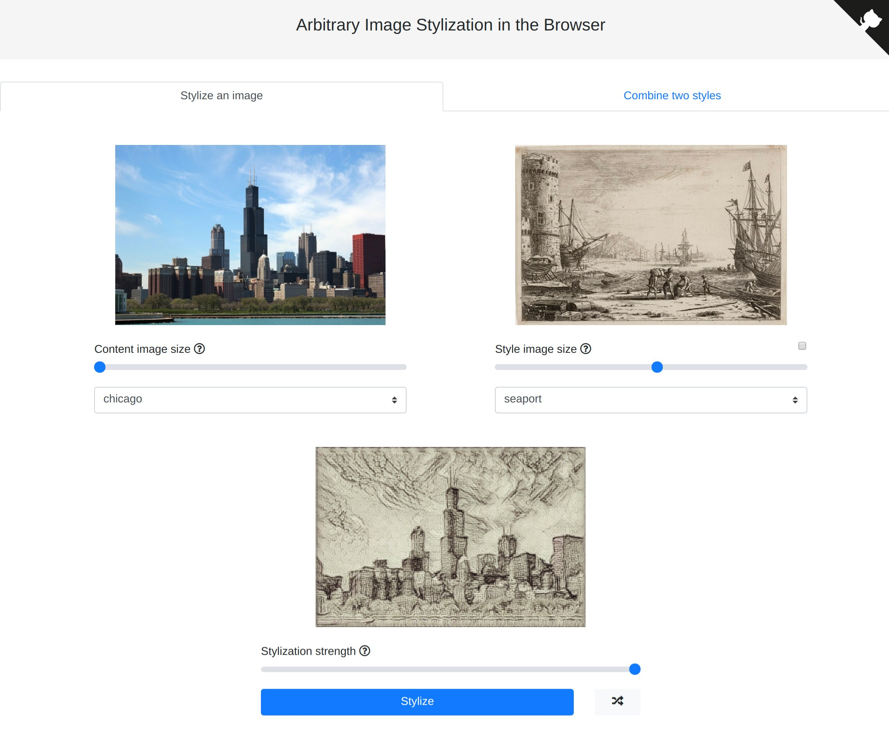
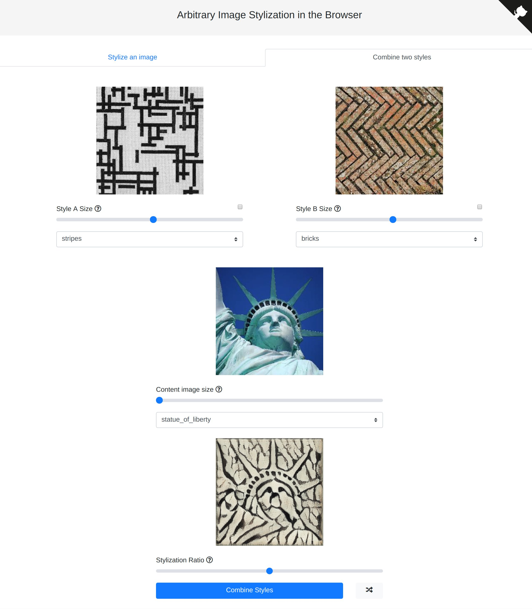

# Arbitrary image stylization in TensorFlow.js

This repository contains an implementation of arbitrary image stylization running fully
inside the browser using TensorFlow.js.

Demo website: https://reiinakano.github.io/fast-style-transfer-deeplearnjs

### Stylize an image



### Combine styles



## FAQ

### What is this?

This is an implementation of an arbitrary image stylization algorithm
running purely in the browser using TensorFlow.js. As with all neural 
style transfer algorithms, a neural network attempts to "draw" one 
picture, the Content (usually a photograph), in the style of another, 
the Style (usually a painting). 

Although [other browser implementations](https://github.com/reiinakano/fast-style-transfer-deeplearnjs)
of style transfer exist,
they are normally limited to a pre-selected handful of styles, due to
the requirement that a separate neural network must be trained for each
style image.

Arbitrary image stylization works around this limitation by using a
separate *style network* that learns to break down *any* image into 
a 100-dimensional vector representing its style. This style vector is 
then fed into another network, the *transformer network*, along
with the content image, to produce the final stylized image.

### Is my data safe? Can you see my pictures?

Your data and pictures here never leave your computer! In fact,
this is one of the main advantages of running neural networks 
in your browser. Instead of sending us your data, we send *you* 
both the model *and* the code to run the model. These are then 
run by your browser.

### How big are the models I'm downloading?

The style network is ~9.6MB, while the transformer network is ~7.9MB,
for a total of ~17.5MB. Since these models work for any style, you only 
have to download them once!

### Are you using the same model as the original paper?

No. The original paper uses an Inception-v3 model 
as the style network (~96.2MB as a .tar.gz), which is too 
large to be deployed in a browser setting.

Before porting this to the browser, a MobileNet-v2 was
used to distill the knowledge from a pretrained Inception-v3 
style network. This resulted in a size reduction over 10x,
from ~96.2MB to ~9.6MB.

### How does style combination work?

Since each style can be mapped to a 100-dimensional 
style vector by the style network,
we simply take a weighted average of the two to get
a new style vector for the transformer network.

This is also how we are able to control the strength
of stylization. We take a weighted average of the style 
vectors of *both* content and style images and use 
it as input to the transformer network.

### Is the code open source?

Yup! The code is [hosted on Github](https://github.com/reiinakano/arbitrary-image-stylization-tfjs).

## Running locally for development

This project uses [Yarn](https://yarnpkg.com/en/) for dependencies.

To run it locally, you must install Yarn and run the following command at the repository's root to get all the dependencies.

```bash
yarn run prep
```

Then, you can run

```bash
yarn run start
```

You can then browse to `localhost:9966` to view the application.


## Credits

This demo could not have been done without the following:

* Authors of the [arbitrary image stylization](https://arxiv.org/abs/1705.06830) paper.
* The Magenta repository for [arbitrary image stylization](https://github.com/tensorflow/magenta/tree/master/magenta/models/arbitrary_image_stylization).
* Authors of [the MobileNet-v2 paper](https://arxiv.org/abs/1801.04381).
* Authors of the paper describing [neural network knowledge distillation](https://arxiv.org/abs/1503.02531).
* The [TensorFlow.js library](https://js.tensorflow.org).
* [Google Colaboratory](https://colab.research.google.com/), with which I was able 
to do all necessary training using a free(!) GPU.

As a final note, I'd love to hear from people interested 
in making a suite of tools for artistically manipulating images, kind of like 
[Magenta Studio](https://magenta.tensorflow.org/studio)
but for images. Please reach out if you're planning to build/are 
building one out!
